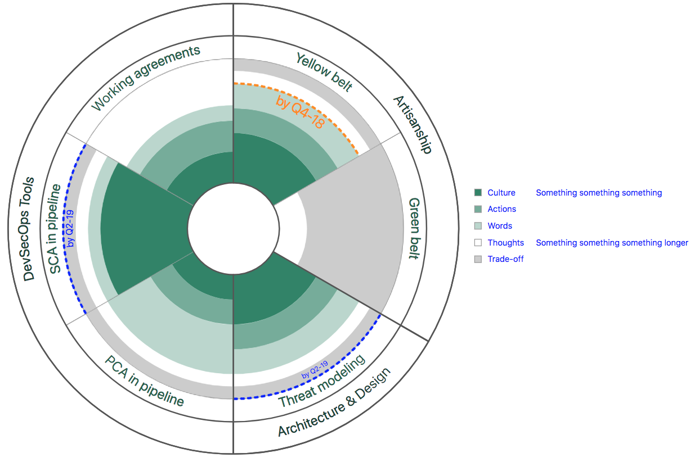

# MatrX-Radar

## What is it?

MatrX-Radar is a radar visualization component.

## How to use

For the chart that is shown above, here is data that was used:

data: {
  // baseColor: "#AA0000",  // Default is MatrX green
  // goalColor: "#AA0000",  // Can be overwritten for a particular goal in disciplines[].practices[].goal.goalColor or if not provided this will default to a nice blue
  // legendFontColor: "#AA0000",  // Defaults to a nice blue
  levelConfig: [
    // levelConfig[0]  is the "best" level, closest to center, and baseColor
    {label: "Culture", description: "Something something something"},
    // Other levels without a color will be a gradient of the baseColor
    {label: "Actions"},
    {label: "Words"},
    // The last index without a color will be white
    {label: "Thoughts", description: "Something something something longer"},
    // You can specify a color for any of the levels, useful for NA or the like
    {label: "Trade-off", color: "#CCCCCC"},
  ],
  disciplines: [
    {
      label: "Artisanship",
      practices: [
        {
          label: "Yellow belt",
          description: "100% of group members... Yellow Belt training",
          levels: [
            {portion: 4},  // Lines up with levelConfig[0] - "Culture"
            {portion: 2},
            {portion: 2},
            {portion: 1},
            {portion: 1},
          ],
          goal: {
            goalColor: "darkorange", //specifies color of goal line and label text
            percentage: 0.8,
            label: "A",
          },
        },
        {label: "Green belt", description: "At least one Green Belt...", levels: [
          {portion: 0},
          {portion: 0},
          {portion: 0},
          {portion: 2},
          {portion: 7},
        ]},
      ]
    },
    {
      label: "Architecture & Design",
      practices: [
        {
          label: "Threat modeling",
          description: "blah blah",
          levels: [
            {portion: 4},
            {portion: 2},
            {portion: 2},
            {portion: 1},
            {portion: 1},
          ],
          goal: {
            label: "A",
          }
        },
      ]
    },
    {
      label: "DevSecOps Tools",
      practices: [
        {label: "PCA in pipeline", description: "blah, blah", levels: [
          {portion: 2},
          {portion: 2},
          {portion: 4},
          {portion: 1},
          {portion: 1},
        ]},
        {
          goal: {
            percentage: 1,
            label: "A"
          },
          label: "SCA in pipeline", description: "blah, blah", levels: [
            {portion: 7},
            {portion: 0},
            {portion: 1},
            {portion: 1},
            {portion: 1},
          ]
        },
        {label: "Working agreements", description: "blah, blah", levels: [
          {portion: 2},
          {portion: 2},
          {portion: 1},
          {portion: 3},
          {portion: 0},
        ]},
      ]
    },
  ]
}

The discipline is the outermost layer and groups together different practices. Each practice has a label and a description, although description is not currently used for anything. The labels for the practices and disciplines are also autosized to fit the appropriate width. Each practice also has any number of levels, and each lever has a portion which represents the size of the corresponding arc. Portions may be given in percentages or in numbers and are later calculated to be a proportion of the sum of the portions. The first level/portion listed is represented by the dark green color. As the levels/portions progress, the transparency of the levels increase and the last portion will be represented by a white arc. We also allow for customization of these levels, including the individual colors.

To the right of the radar visualization we have added a legend that automatically matches the colors of the levels for the key, and allows for a label and description. We autosize the text so that it fits, and we also restrict the maximum size of the font to be the size of the discipline font.
